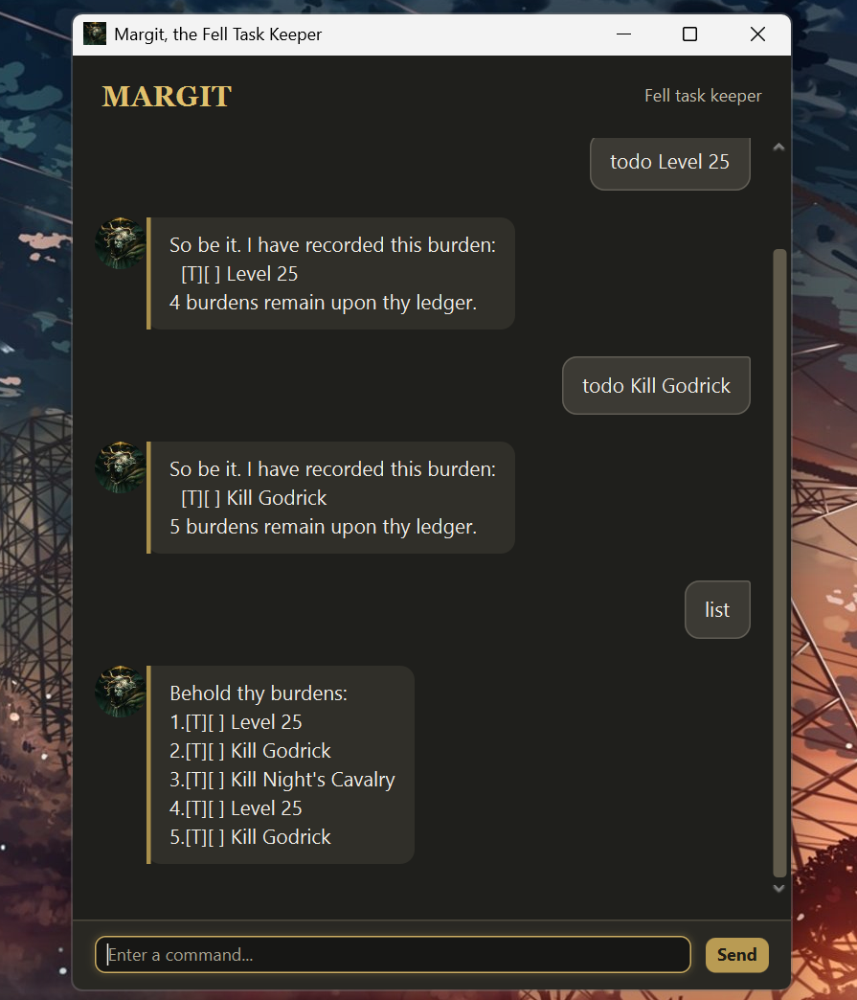

# Margit User Guide



Margit, the Fell Task Keeper, is a desktop task manager for recording,
reviewing, and planning the burdens before thee. Commands are entered in the
chat input at the bottom of the window. Margit saves the task list after every
change, so it is available the next time the application opens.

## Getting started

Launch Margit from your IDE by running `margit.Launcher`, or build the project
with Gradle and run the generated JAR file. Type a command and press Enter or
select **Send**. Margit greets you when the application opens.

## Task types

Margit manages three kinds of task:

- **Todo**: a task without a date or time.
- **Deadline**: a task due by a date or date-time.
- **Event**: a task that has a start and end date or date-time.

Tasks are saved automatically in `data/Margit.txt` relative to the folder from
which the application is launched.

## Date and time formats

Use either a date or a date-time when creating deadlines and events. Margit
accepts the following common formats:

```text
19/9/2026
2026-09-19
19/9/2026 1900
2026-09-19 19:00
```

A deadline given as a date only is treated as due at 23:59 on that date when
tasks are sorted.

## Managing tasks

### Add a todo

Adds a task without a date or time.

```text
todo Review week 5 lecture notes
```

### Add a deadline

Adds a task with a required `/by` date or date-time.

```text
deadline Submit weekly reflection /by 19/9/2026 2359
```

### Add an event

Adds a task with required `/from` and `/to` dates or date-times.

```text
event Project planning meeting /from 18/9/2026 1900 /to 18/9/2026 2030
```

### List tasks

Shows every task in its current saved order.

```text
list
```

### Mark or unmark a task

Marks a numbered task as complete, or restores it as incomplete. Use the task
number shown by `list`.

```text
mark 2
unmark 2
```

### Delete a task

Removes a numbered task permanently.

```text
delete 3
```

## Finding and planning tasks

### Find by keyword

Shows tasks whose descriptions contain the given keyword. Matching is
case-sensitive.

```text
find project
```

### View a date

Shows deadlines and events that fall on the given date. Events that span the
date are included.

```text
on 19/9/2026
```

### Sort tasks

Permanently sorts tasks in ascending order. Todos remain first, followed by
undated tasks and then scheduled tasks. Scheduled tasks are ordered by event
start time or deadline due time.

```text
sort
```

### End a terminal session

Use `bye` to end Margit's terminal session. In the GUI, it displays Margit's
farewell while leaving the application window open.

```text
bye
```
